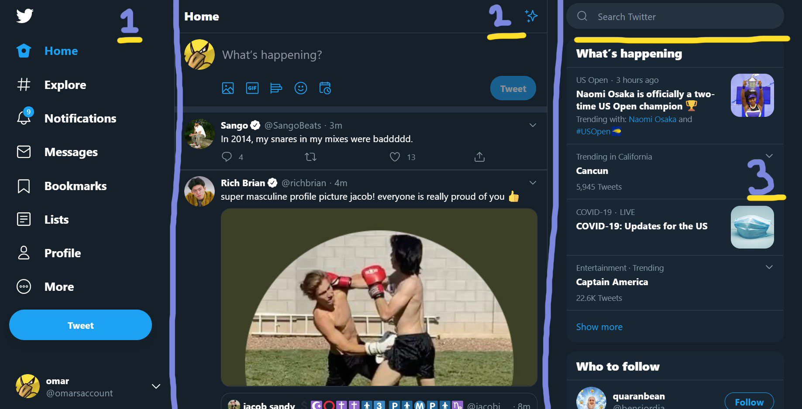
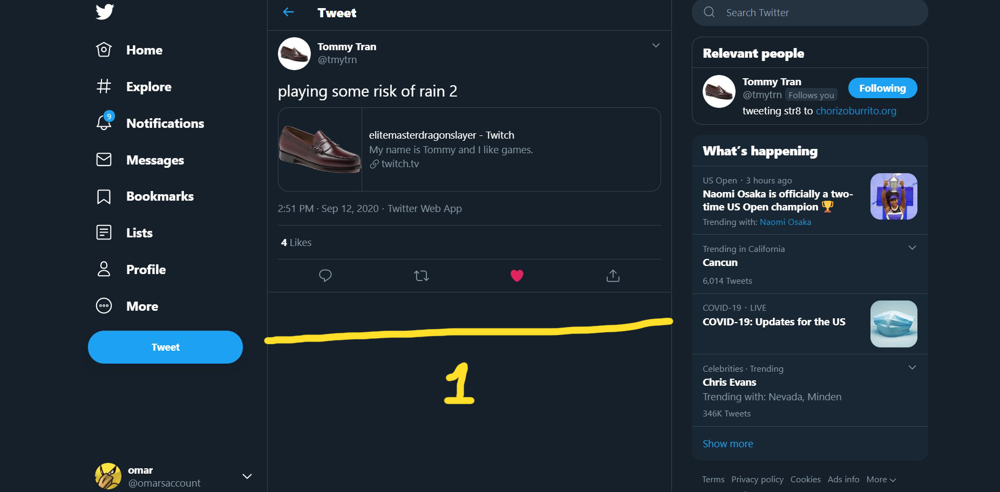
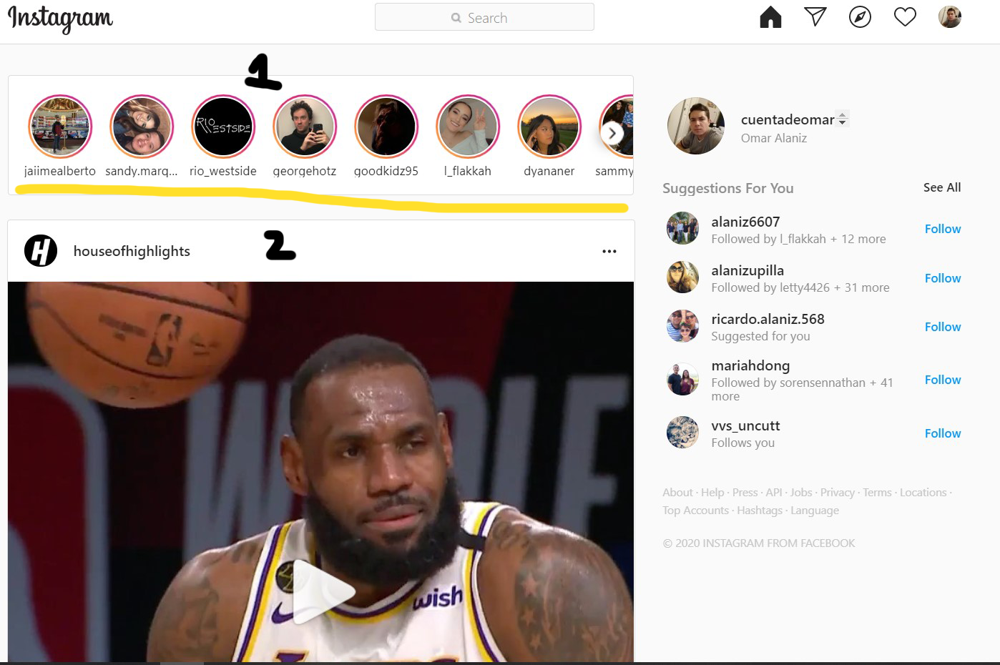
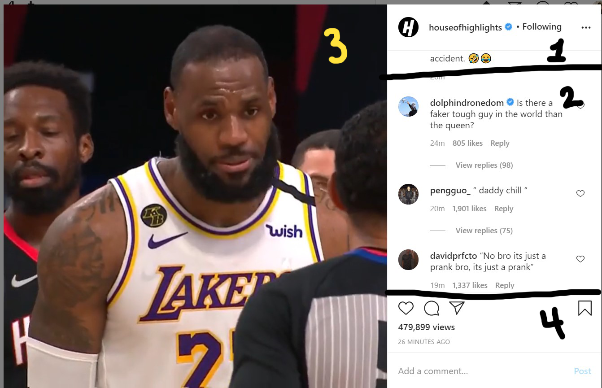

# Looking at other wack social Platforms
## Twitter

### **Observation**
- Twitter is split into three panes: (1) nav bar, (2) timeline, (3) quick actions or information 

### **Observations**
- (1) When clicking on a Tweet it replaces the timeline from the middle pane

## Instagram

### **Observation**
- Split into two parts stories and posts

### **Observation**
- When clicking on a post it is clicked into four parts
  - Main poster, Comments, Text input for user to comment, and the actual post itself